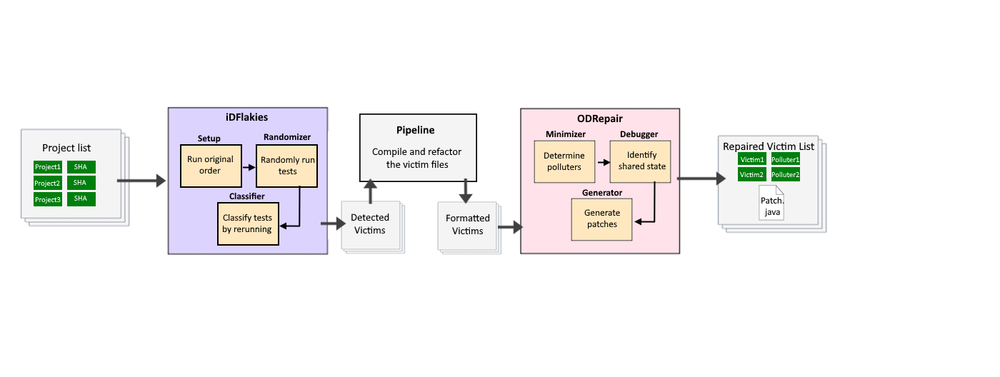

# intIDRepair

This repository contains intIDRepair, an integration capable of detecting order-dependent flaky tests and subsequently generating repair patches for maven or gradle Java projects. 

To accomplish this intIDRepair unifies the detection tool [iDFlakies](https://github.com/UT-SE-Research/iDFlakies) with the repair tool [ODRepair](https://github.com/UT-SE-Research/ODRepair). intIDRepair is a simple integration and does not alter the functioning of its component tools.

## Configuration

__Requirements__

- A Linux based system
- Docker
- Python 2.7+

__Usage__

Run the following command on the repository root:

``` 
./run.sh <path to input csv> <path to input properties file>
```

__Input__

As input the script takes two arguments:

- A csv containing a list project/SHA to analyze
- A properties file to allow specifying other arguments to iDFlakies (round_number, timeout, script_to_run)

__Example__

An example can be executed with the following command:

``` 
./run.sh example.csv properties.txt
```

This example takes around 3 hours to execute. The generated output will be present in ```output/<date_time_RandomID>```. 

The list of detected flaky tests will be present in ```detected_flaky_tests.csv``` while the details of repaired tests will be present in  ```repair_results.csv```. 

All logs and relevant output of idFlakies and ODRepair are also copied into the output folder.

## Study

intIDRepair was developed as part of a dissertation in partial fulfillment of the requirements for the degree of Master in Informatics Engineering in ISEP.

Support data and the methodologies utilized in the study can be freely accessed in the ```researchData``` folder. Additionally the [execution results](https://drive.google.com/file/d/1Yt7KIQbFmcLHY2ZhU5PthdsViXrF--ZM/view?usp=sharing) for all the tools analyzed in the study are made publicly available. 


## Design



intIDRepair is composed of three separate components:

1. __iDFlakies__ - The integration utilizes iDFlakies’ framework which, given a set of projects, isolates each one in a docker container and performs the following steps to detect flakiness:
    - Setup – The tool checks whether all tests of a module pass, if not, no further exploration is done for that module. 
    - Randomizer – The tool executes the project’s tests according to various randomized orders based on a user-specified number of rounds.
    - Classification – The tool reruns failing and passing orders for each test to categorize it as OD or NOD.
Once the detection process is complete, the produced output is organized into separate modules mirroring the analyzed project. The output lists the flaky tests, their category, and their respective passing and failing orders.
2. __Pipeline__ - The pipeline unique to intIDRepair handles the processing of the output data produced by iDFlakies to format it into a valid input for ODRepair. To do this, it performs the following steps:
    - Gather the produced lists of flaky tests spread across various modules compiling them into a single file.
    - Refactor the qualified test names into valid formats while removing invalid or duplicate lines.
    - Append the tests’ corresponding project URL and git SHA.
3. __ODRepair__ - To repair the identified flaky tests, the integration executes ODRepair, which for each OD test identifies its polluter and attempts to generate a patch. To do so it performs the following steps:
    - Minimizer – Given the identified flaky test, ODRepair utilizes the Minimizer component from iFixFlakies to determine its polluter.
    - Debugger – Identifies the shared state that the polluter modifies in such a way that the order-dependent test fails in the failing test order.
    - Generator – With the OD test and its polluted static field identified in the Debugger, a patch can be generated using Randoop. When the patch is applied right before the OD test, it can pass when run after the polluter in the failing test order.


